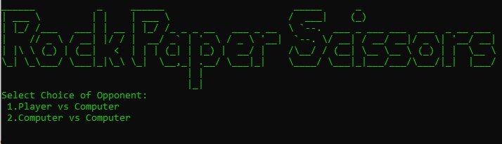
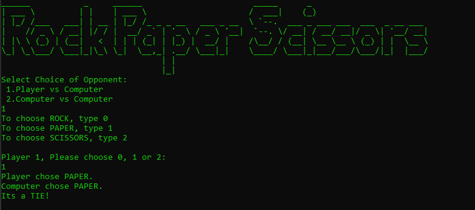

# RockPaperScissors
A basic RockPaperScissors Command Line Game.

```
______           _     ______                       _____      _                        
| ___ \         | |    | ___ \                     /  ___|    (_)                       
| |_/ /___   ___| | __ | |_/ /_ _ _ __   ___ _ __  \ `--.  ___ _ ___ ___  ___  _ __ ___ 
|    // _ \ / __| |/ / |  __/ _` | '_ \ / _ \ '__|  `--. \/ __| / __/ __|/ _ \| '__/ __|
| |\ \ (_) | (__|   <  | | | (_| | |_) |  __/ |    /\__/ / (__| \__ \__ \ (_) | |  \__ \
\_| \_\___/ \___|_|\_\ \_|  \__,_| .__/ \___|_|    \____/ \___|_|___/___/\___/|_|  |___/
                                 | |                                                    
                                 |_|                                                    
```


# Setting up

**Prerequisites**

* JDK 11
* Recommended: IntelliJ IDE
* Repo : **https://github.com/Opkko/RockPaperScissors**
* Fork this repo to your GitHub account and clone the fork to your computer

**Importing the project into IntelliJ**

1. Open IntelliJ (if you are not in the welcome screen, click `File` > `Close Project` to close the existing project dialog first).
1. Set up the correct JDK version.
    * Click `Configure` > `Structure for new Projects` (in older versions of Intellij:`Configure` > `Project Defaults` > `Project Structure`).
    * If JDK 11 is listed in the drop down, select it. If it is not, click `New...` and select the directory where you installed JDK 11.
    * Click `OK`.
1. Click `Import Project`.
1. Locate the project directory and click `OK`.
1. Select `Create project from existing sources` and click `Next`.
1. Rename the project if you want. Click `Next`.
1. Ensure that your src folder is checked. Keep clicking `Next`.
1. Click `Finish`.


### If you are using Gradle

Update your `build.gradle` to include the following lines:
```groovy
plugins {
   id 'java'
   id 'application'
   id 'com.github.johnrengelman.shadow' version '5.1.0'
}

repositories {
   mavenCentral()
}

application {
   // Change this to your main class.
   mainClassName = "Launcher"
}

apply plugin: "com.github.johnrengelman.shadow"

```

# User Guide

## Features

### Asks User for Game Mode of Choice:

#### example:




### Asks User for Input Choice, Rock Scissors or Paper - Command : todo


#### example:


### Displays Result 

#### example:


### Asks if User wants to continue playing

#### example:


# Sample Flow

### Sequential order

#### Player vs Computer

`[input]` : `1`

`[input]` : `2`

`[input]` : `y`

#### Computer Vs Computer

`[input]` : `2`

`[input]` : `y`

# How to Run Jar File

`Step 1:`

`copy jar file to empy directory`

`type cmd in explorer header`

`type java -jar <jar file name>`

**it can be located under build\lib**
